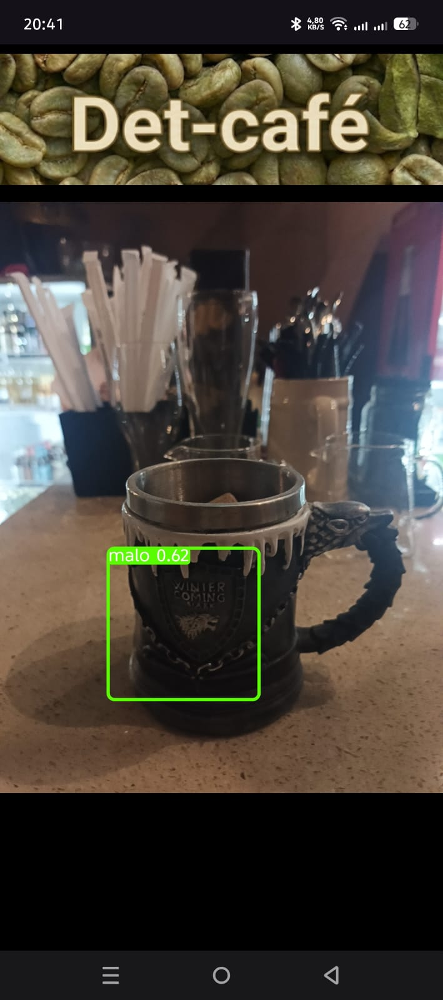

### Implementación portátil de modelos YOLOv10 para la detección inteligente de defectos fı́sicos en café verde

Este repositorio presenta una implementación en Android, del modelo YOLOv10n entrenado para detectar defectos físicos en granos de café verde, en tiempo real.

En la imagen de la izquierda se puede apreciar el modelo sin entrenar, la imagen de la derecha muestra el modelo entrenado.

  
  

# Demo

## Uso
1. Clonar el repositorio localmente.
2. Abrir el proyecto en Android Studio y compilar.
3. Instalar la aplicación en el teléfono móvil.
4. Comenzar a detectar.

## Recursos:
1. Guía para la implementación paso a paso: Blog [Medium](https://medium.com/google-developer-experts/yolov10-to-litert-object-detection-on-android-with-google-ai-edge-2d0de5619e71).
2. Documentación oficial de [YOLOv10](https://docs.ultralytics.com/models/yolov10/) de Ultralytics.
3. Google AI Edge [LiteRT](https://ai.google.dev/edge/litert).

